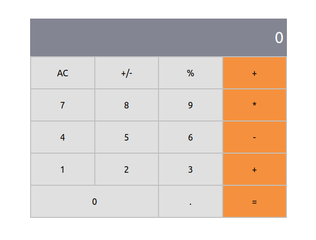

# Math Magicians

> Math magicians is a website that has a functional calculator.

## Built With

- CSS
- React

## Getting Started

To get a local copy up and running follow these simple example steps.

### Setup

1.  Open a terminal, navigate to the directory that you would like to clone the repository into using commands like:
    - `cd /pathname` to change your working directory.
2.  Next, clone the remote repository and create a local copy on your machine using this command:
    - `git clone https://github.com/afizsavage/math-magicians`
3.  Now you can see the contents of the remote repository on your machine by moving into the newly cloned directory:
    - `math-magicians`
    - `ls -la`
4.  run `npm install` on the command line to download all dependency packages.

### Run

1. run `npm run build` Builds the app for production to the `build` folder.\.
2. run `npm start` Runs the app in the development mode.\.
3. webpack-dev-server will automatically open `http://localhost:8080/` in your default browser.

## Author

👤 **Afiz Savage**

- GitHub: [@afizsavage](https://github.com/afizsavage)
- Twitter: [@fizzo_geek](https://twitter.com/fizzo_geek)
- LinkedIn: [@Afiz](https://www.linkedin.com/in/afiz-savage-3b91a21ba/)

## Show your support

Give a ⭐️ if you like this project!
